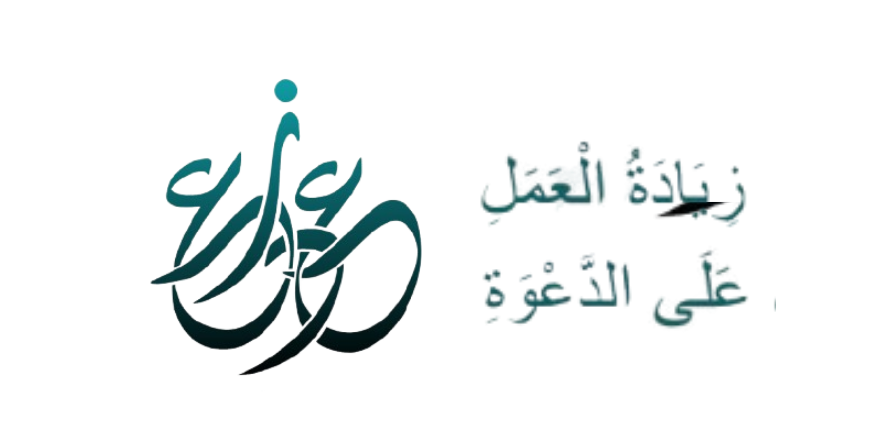
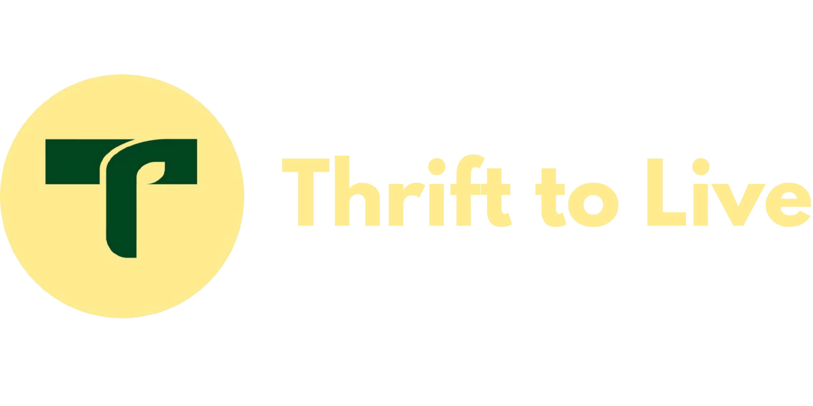
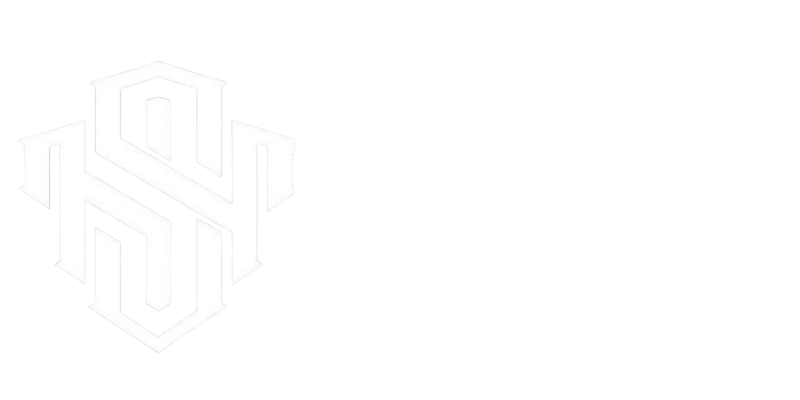
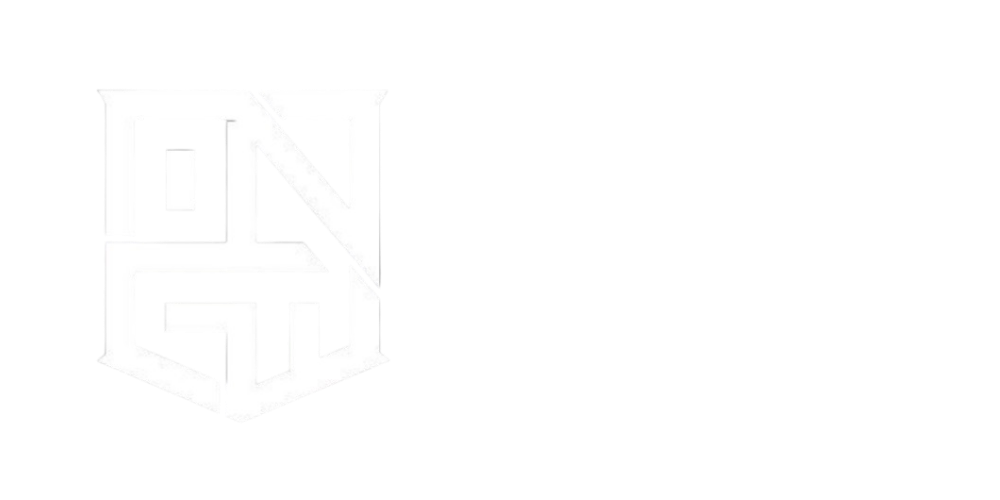
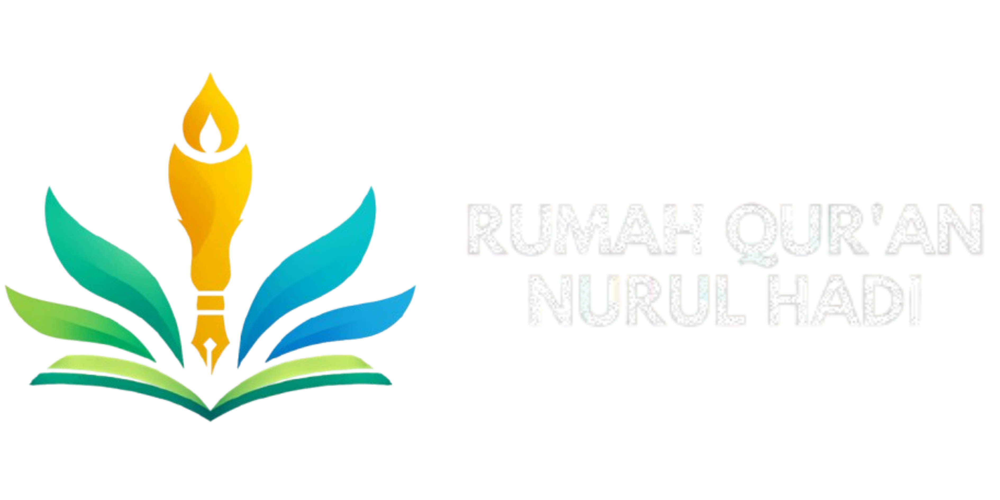
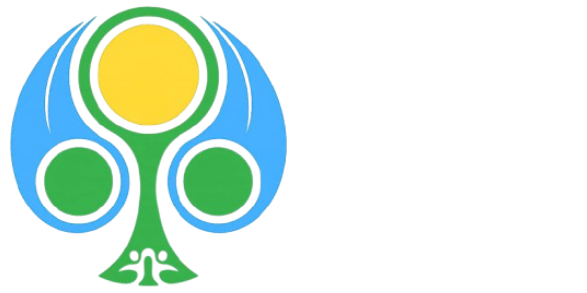
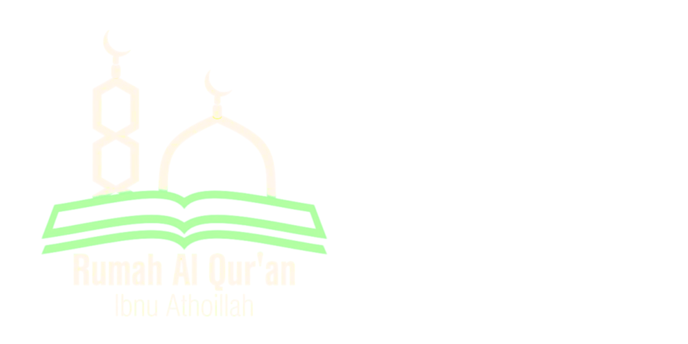
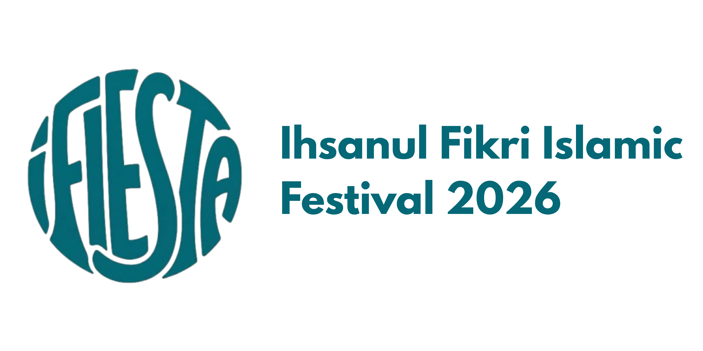
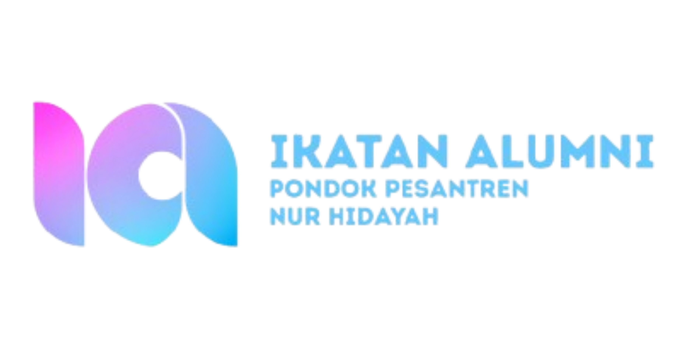
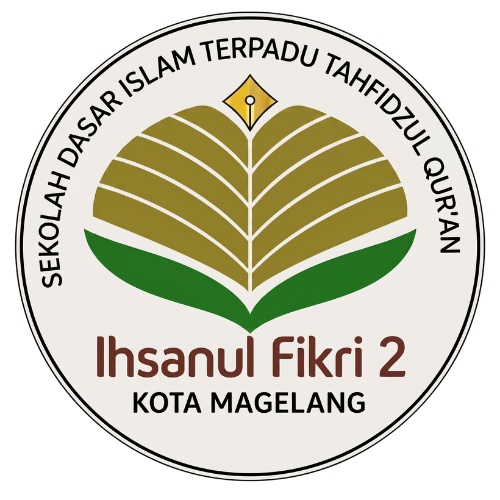

<!DOCTYPE html>
<html lang="id" class="scroll-smooth">
<head>
    <meta charset="UTF-8">
    <meta name="viewport" content="width=device-width, initial-scale=1.0">
    <title>Aqil | Creative IT Professional</title>
    
    <!-- Google Fonts -->
    <link rel="preconnect" href="https://fonts.googleapis.com">
    <link rel="preconnect" href="https://fonts.gstatic.com" crossorigin>
    <link href="https://fonts.googleapis.com/css2?family=Anton&family=Inter:wght@300;400;600;800&display=swap" rel="stylesheet">
    
    <!-- Tailwind CSS -->
    
    

    <!-- Custom CSS -->
    
</head>
<body class="antialiased selection:bg-brand selection:text-white">

    <!-- Navigation -->
    <nav class="fixed top-0 w-full z-50 mix-blend-difference p-6 backdrop-blur-sm bg-black/10">
        

            <a href="#" class="font-display text-2xl tracking-widest uppercase">AQIL.</a>
            

                <a href="#about" class="hover:text-brand transition-colors">About</a>
                <a href="#services" class="hover:text-brand transition-colors">Services</a>
                <a href="#projects" class="hover:text-brand transition-colors">Case Studies</a>
            

            <a href="#contact" class="bg-white text-black px-6 py-2 rounded-full text-sm font-bold hover:bg-brand hover:text-white transition-all transform hover:scale-105">
                CONTACT ME
            </a>
        

    </nav>

    <!-- HERO SECTION -->
    <header class="relative min-h-screen flex items-center justify-center overflow-hidden pt-20 pb-10">
        <!-- Background Text -->
        

            <h1 class="font-display text-[20vw] leading-[0.8] text-outline">DEVELOPER</h1>
            <h1 class="font-display text-[20vw] leading-[0.8] text-outline">DESIGNER</h1>
        

        <!-- Main Content -->
        

            <h1 class="font-display text-[15vw] md:text-[12vw] leading-none tracking-tight mb-[-5%] gs-reveal">
                HI, I'M AQIL
            </h1>
            
            <!-- Avatar Area -->
            

                <!-- Efek Glow di belakang avatar -->
                

                
                <!-- Gambar Avatar 3D -->
                
                
                <!-- Floating Badges -->
                
Web Dev 💻

                
Lim Qiel Design 🎨

            

            
            

                Membantu instansi dan <strong class="text-white">brand</strong> tampil menonjol lewat identitas visual yang solid, sekaligus membangun ekosistem digital dan sistem informasi yang efisien.
            

        

    </header>

    <!-- CLIENTS / BRANDS SECTION -->
    <section class="py-8 border-t border-zinc-900 bg-dark overflow-hidden relative gs-reveal">
        <!-- Efek bayangan gelap di kanan-kiri agar animasi terlihat natural (fade out) -->
        

        

        

            <!-- Group 1 -->
            

                
                
                
                
                
                
                
                
                
                
                
            

            
            <!-- Group 2 (Duplikat untuk efek Infinite Loop yang tidak terputus) -->
            

                <!-- Pastikan urutan dan isi logo di sini sama persis dengan Group 1 -->
                
                
                
                
                
                
                
                
                
                
                
            

        

    </section>

    <!-- ABOUT SECTION -->
    <section id="about" class="py-32 px-6 relative max-w-6xl mx-auto flex flex-col items-center text-center">
        <!-- Floating Elements Background -->
        

            
✨

            
💜

            
👾

            
⚡

        

        <h2 class="font-display text-6xl md:text-8xl tracking-wider mb-8 gs-fade">ABOUT ME</h2>
        

            Mahasiswa IT yang punya ketertarikan mendalam pada dua dunia: Logika (Code) dan Estetika (Design). 
            Melalui Lim Qiel Design, saya membantu brand tampil menonjol. Di ranah digital, saya mengembangkan sistem cerdas seperti SIMPANDA.
        

        <button class="mt-12 bg-white text-black px-8 py-4 rounded-full text-lg font-bold hover:bg-brand hover:text-white transition-all transform hover:scale-105 gs-fade">
            DOWNLOAD CV
        </button>
    </section>

    <!-- SERVICES (ACCORDION) SECTION -->
    <section id="services" class="py-24 px-6 max-w-6xl mx-auto">
        <h2 class="font-display text-5xl md:text-7xl mb-12 gs-fade border-b border-zinc-800 pb-6">EXPERTISE & SERVICES</h2>
        
        

            <!-- Accordion Item 1 -->
            

                

                    

                        01
                        <h3 class="font-display text-3xl md:text-5xl group-hover:pl-4 transition-all duration-300">SISTEM INFORMASI & WEB DEV</h3>
                    

                    +
                

                

                    

                        Membangun ekosistem digital untuk instansi pendidikan. Layanan meliputi pembuatan <strong>SPMB Online</strong>, platform <strong>Ujian Online (CBT)</strong>, manajemen <strong>Database Sekolah (SIMPANDA)</strong>, hingga sistem <strong>Perpustakaan Online</strong> yang saling terintegrasi.
                    

                

            

            <!-- Accordion Item 2 -->
            

                

                    

                        02
                        <h3 class="font-display text-3xl md:text-5xl group-hover:pl-4 transition-all duration-300">GRAPHIC DESIGN & BRANDING</h3>
                    

                    +
                

                

                    

                        Melalui studio <strong>Lim Qiel Design</strong>, saya merancang logo, wordmark, dan identitas visual (<strong>brand identity</strong>) menyeluruh. Saya memastikan UI/UX website Anda tidak hanya fungsional, tapi juga memiliki daya tarik visual yang modern dan kredibel.
                    

                

            

            <!-- Accordion Item 3 -->
            

                

                    

                        03
                        <h3 class="font-display text-3xl md:text-5xl group-hover:pl-4 transition-all duration-300">SOCIAL MEDIA STRATEGY</h3>
                    

                    +
                

                

                    

                        Mengelola kampanye digital dan media sosial instansi. Berpengalaman menemukan <strong>sweet spot</strong> antara mengikuti tren algoritma video pendek terkini dengan menjaga <strong>brand safety</strong> dan nilai-nilai syariat/lembaga.
                    

                

            

        

    </section>

    <!-- CASE STUDIES SECTION -->
    <section id="projects" class="py-24 px-6 bg-zinc-950">
        

            <h2 class="font-display text-5xl md:text-7xl mb-16 text-center gs-fade">FEATURED CASE STUDIES</h2>
            
            

                
                <!-- Case Study 1: Web & Sistem Sekolah -->
                

                    

                        
SaaS & Web Development

                        <h3 class="font-display text-4xl md:text-5xl leading-tight">Revamp Website Sekolah & Integrasi Ekosistem Digital</h3>
                        
                        

                            
<strong class="text-white">The Challenge:</strong> Situs web sekolah sebelumnya kurang menarik secara visual dan sistem administrasi masih serba manual—mulai dari pendaftaran siswa hingga pencatatan absensi yang memakan banyak kertas.

                            
                            
<strong class="text-white">The Solution:</strong> Membangun ulang UI/UX <strong>website</strong> utama menggunakan WordPress & Elementor sebagai wajah digital yang modern. Selanjutnya, merancang antarmuka untuk ekosistem internal yang komprehensif dengan sistem <strong>sidebar</strong> terpusat.

                            
                            

                                <h4 class="font-bold text-white mb-3">Modul Sistem Terintegrasi:</h4>
                                <ul class="list-disc pl-5 space-y-2 text-sm">
                                    <li><strong class="text-brand">SPMB Online:</strong> Pendaftaran siswa langsung via web tanpa birokrasi manual.</li>
                                    <li><strong class="text-brand">Ujian Online:</strong> Platform CBT mandiri untuk evaluasi akademik.</li>
                                    <li><strong class="text-brand">SIMPANDA:</strong> Database terpusat untuk absensi guru dan data siswa.</li>
                                    <li><strong class="text-brand">Perpustakaan Online:</strong> Digitalisasi peminjaman buku.</li>
                                </ul>
                            

                        

                    

                    

                        

                            <!-- Placeholder Gambar Dashboard Web -->
                            
                        

                    

                

                

                <!-- Case Study 2: Social Media Pesantren -->
                

                    

                        

                            <!-- Placeholder Gambar Sosmed / HP -->
                            
                        

                    

                    

                        
Social Media & Branding

                        <h3 class="font-display text-4xl md:text-5xl leading-tight">Digital Branding & Manajemen Konten Pesantren</h3>
                        
                        

                            
<strong class="text-white">The Challenge:</strong> Bagaimana meningkatkan jangkauan digital sebuah institusi pendidikan Islam dengan memanfaatkan tren media sosial modern, tanpa keluar dari koridor syariat dan tata tertib asrama?

                            
                            
<strong class="text-white">The Strategy:</strong> Bertindak sebagai kreator sekaligus eksekutor visual. Saya menerjemahkan rutinitas pesantren ke dalam <strong>storytelling</strong> dan <strong>short-form video</strong> yang relevan dengan algoritma terkini.

                            
                            
<strong class="text-white">The Impact:</strong>

                            <ul class="list-disc pl-5 space-y-2 text-sm">
                                <li>Menciptakan citra institusi yang tidak kaku dan lebih <strong>approachable</strong> bagi generasi muda.</li>
                                <li>Memproduksi seluruh materi desain grafis secara <strong>in-house</strong> (poster kajian, info SPMB) dengan standar visual <strong>Lim Qiel Design</strong> yang konsisten dan rapi.</li>
                            </ul>
                        

                    

                

            

        

    </section>

    <!-- FULL PORTFOLIO (TAB SYSTEM) -->
   <section id="full-portfolio" class="py-24 px-6 bg-dark border-t border-zinc-900">
        

            <h2 class="font-display text-5xl md:text-7xl mb-12 text-center gs-fade">FULL PORTFOLIO</h2>
            
            

                <button class="tab-btn active px-6 py-3 rounded-full border border-zinc-700 bg-white text-black font-bold transition-all text-sm uppercase tracking-wider" data-target="tab-design">
                    Graphic Design
                </button>
                <button class="tab-btn px-6 py-3 rounded-full border border-zinc-700 bg-transparent text-zinc-400 hover:bg-zinc-800 hover:text-white font-bold transition-all text-sm uppercase tracking-wider" data-target="tab-media">
                    Audio & Video
                </button>
                <button class="tab-btn px-6 py-3 rounded-full border border-zinc-700 bg-transparent text-zinc-400 hover:bg-zinc-800 hover:text-white font-bold transition-all text-sm uppercase tracking-wider" data-target="tab-achievements">
                    Achievements
                </button>
            

            

                

                    

                        
                    

                    

                        
                    

                    

                        
                    

                     

            

            

                

                    

                        <h3 class="text-white font-bold mb-4 tracking-wide uppercase text-sm border-b border-zinc-800 pb-2">Music Video Production</h3>
                        

                            <iframe width="100%" height="100%" src="https://www.youtube.com/embed/dQw4w9WgXcQ" title="YouTube video player" frameborder="0" allow="accelerometer; autoplay; clipboard-write; encrypted-media; gyroscope; picture-in-picture" allowfullscreen></iframe>
                        

                    

                    

                        <h3 class="text-white font-bold mb-4 tracking-wide uppercase text-sm border-b border-zinc-800 pb-2">Original Composition (BandLab)</h3>
                        

                            [ Paste Kode Embed BandLab di sini ]
                        

                    

                

            

            

                

                    

                        
🏆

                        Juara 1
                        <h3 class="font-display text-3xl md:text-4xl mb-4 text-white">Lomba Desain Ucapan Hari Raya</h3>
                        
Berhasil meraih juara pertama dalam merancang visual ucapan selamat hari raya dengan komposisi yang seimbang antara tipografi dan elemen syariat.

                        
                        

                            
                        

                    

                

            

        

    </section>

    <!-- FOOTER / CONTACT -->
    <footer id="contact" class="pt-32 pb-10 bg-zinc-950 flex flex-col items-center text-center overflow-hidden relative">
        <h2 class="font-display text-[12vw] leading-none mb-6 text-white hover:text-brand transition-colors duration-500 cursor-pointer text-outline">
            LET'S TALK
        </h2>
        
        
Punya proyek digitalisasi sekolah, butuh rebranding logo, atau mau optimasi konten sosial media? Mari diskusikan bersama.

        

            <!-- Logo Instagram dengan link aslimu -->
            
            
            <!-- Logo WhatsApp dengan link aslimu -->
            
        

        

            
&copy; 2024 Aqil / Lim Qiel Design. All rights reserved.

            
Crafted with Logic & Aesthetics.

        

    </footer>

    <!-- GSAP & Scripts -->
    
    
    
</body>
</html>
